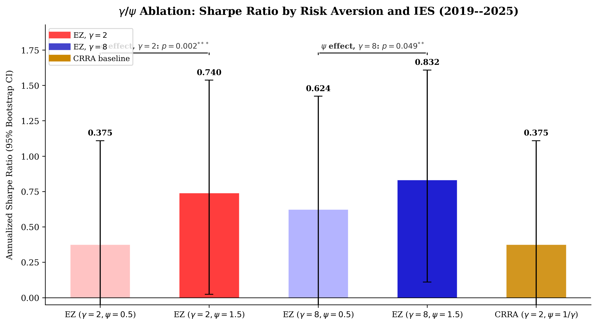
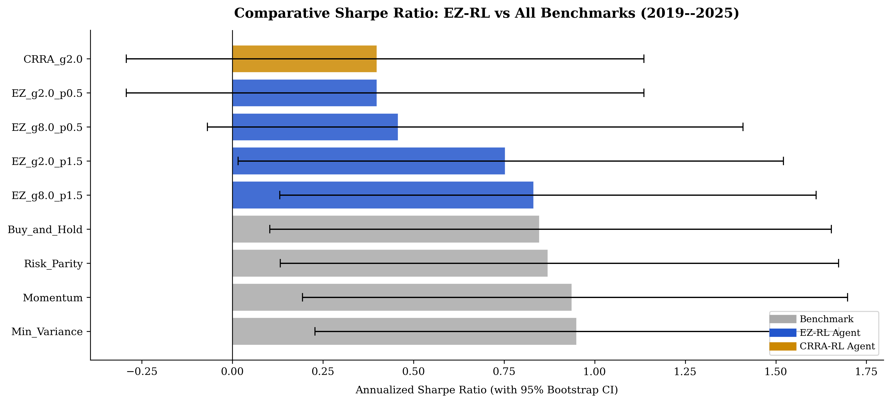
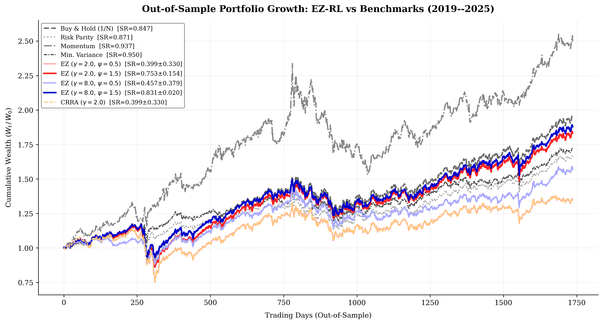
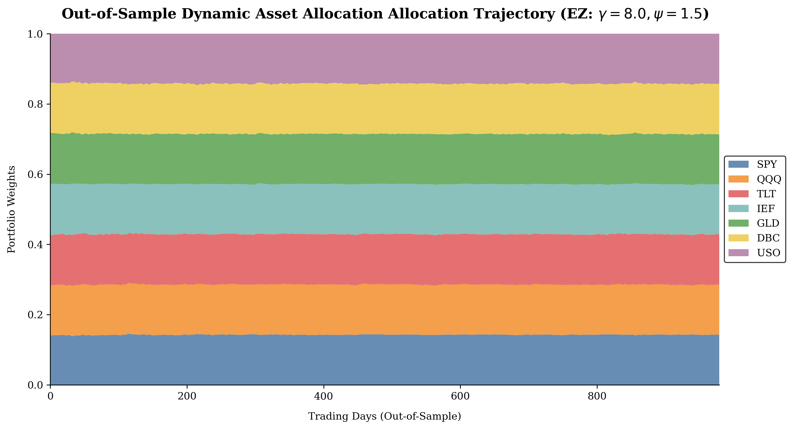
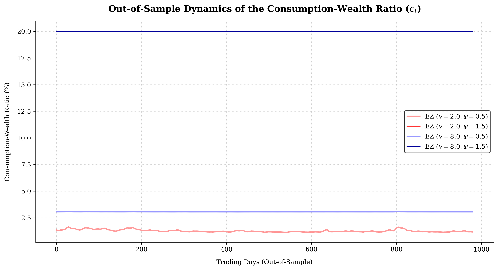
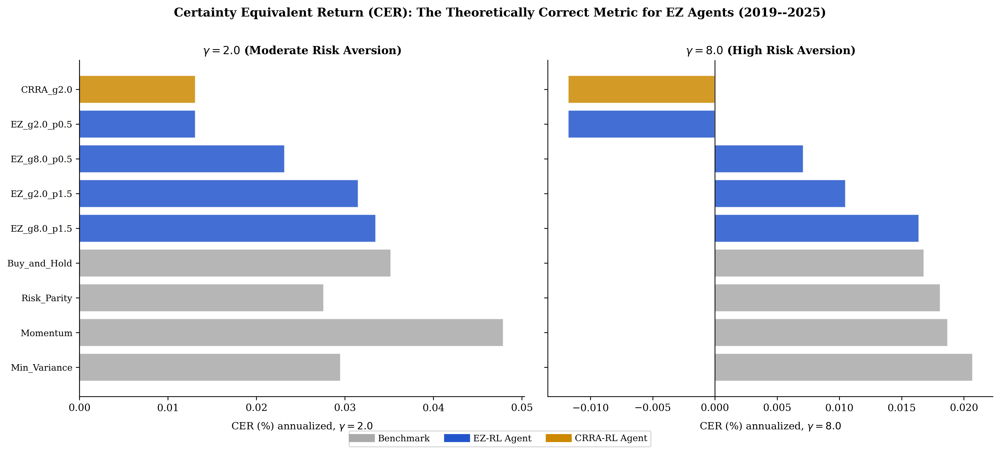
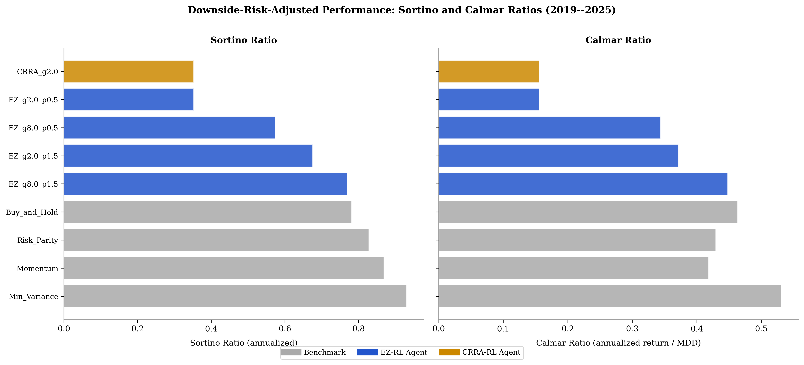

# Deep Distributional Reinforcement Learning for Dynamic Asset Allocation under Epstein-Zin Recursive Utility

**WonChan Cho** · Department of Mathematics, Sungkyunkwan University · July 2026

---

## Overview

This repository implements a mathematically rigorous framework combining **Deep Distributional Reinforcement Learning (DRL)** with **Epstein-Zin (EZ) recursive preferences** to solve the dynamic, multi-asset consumption-portfolio choice problem under transaction costs.

Classical CRRA utility constrains risk aversion ($\gamma$) and the intertemporal elasticity of substitution (IES, $\psi$) to be reciprocals ($\psi = 1/\gamma$), conflating two economically distinct preferences. This framework **decouples** $\gamma$ and $\psi$ using EZ utility, and learns optimal portfolio and consumption policies end-to-end via an **Implicit Quantile Network (IQN)** critic.

---

## Theoretical Contributions

### 1. Epstein-Zin Recursive Utility

The investor solves:

$$V_t = \left[ (1 - \beta) C_t^{1 - \frac{1}{\psi}} + \beta \left( \mathcal{R}_t(V_{t+1}) \right)^{1 - \frac{1}{\psi}} \right]^{\frac{1}{1 - \frac{1}{\psi}}}$$

where $\mathcal{R}_t(X) = \left( \mathbb{E}_t \left[ X^{1 - \gamma} \right] \right)^{\frac{1}{1 - \gamma}}$ is the CRRA certainty equivalent.

### 2. Key Theorems

**Theorem 1 — Wealth-Homotheticity.** The value function scales linearly with wealth:

$$V_t(W_t, \mathbf{s}_t) = W_t \cdot v_t(\mathbf{s}_t)$$

This reduces the problem to solving in weight space, independent of absolute wealth.

**Lemma 1 — Quantile Representation.** The certainty equivalent equals a Lebesgue integral over quantiles:

$$\mathcal{R}_t(Y_{t+1}) = \left( \int_0^1 \left( q_Y(\tau) \right)^{1 - \gamma} d\tau \right)^{\frac{1}{1 - \gamma}}$$

This justifies using IQN outputs directly as Bellman targets.

**Theorem 2 — Contraction Mapping.** The EZ Bellman operator $\mathcal{T}$ is a local contraction on $\mathcal{C}(\mathcal{S})$ under the supremum norm when:

$$\kappa \equiv \beta \cdot \sup_{s, \mathbf{w}} \left( \mathbb{E} \left[ R_p(\mathbf{w})^{1-\gamma} \mid s \right] \right)^{\frac{1 - 1/\psi}{1 - \gamma}} < 1$$

guaranteeing convergence to a unique fixed-point value function $v^*$.

**Theorem 3 — No-Trade Region.** Under proportional transaction cost `cost`, the investor does not rebalance when:

$$\left\| \nabla_{\mathbf{w}} v_t(\mathbf{s}_t) \right\|_2 < \text{cost} \cdot (1 - c_t^*)$$

---

## Architecture

### Components

| Module | Description |
|--------|-------------|
| **AssetTransformer** | Permutation-invariant multi-head self-attention over the asset dimension |
| **Actor (Weight Head)** | Outputs per-asset scores → Softmax portfolio weights $\mathbf{w}_t \in \Delta^N$ |
| **Actor (Consumption Head)** | Mean-pooled features → MLP + Sigmoid → consumption fraction $c_t \in [1\%, 20\%]$ |
| **IQN Critic** | Cosine-embedded quantile samples → distributional value function |
| **LSE Certainty Equivalent** | Numerically stable Log-Sum-Exp solver for high-$\gamma$ training |

### Numerical Stability (Log-Sum-Exp)

Under high risk aversion ($\gamma = 8$), naive computation of $Y^{1-\gamma} = Y^{-7}$ overflows float32. We use:

$$\mathcal{R}_t(Y_{t+1}) = \exp \left( \frac{1}{1 - \gamma} \left( \log\text{-}\mathrm{sum}\text{-}\exp\!\left(\{(1-\gamma) \ln Y_k\}_{k=1}^K\right) - \ln K \right) \right)$$

This prevents NaN gradients and enables stable training at all $(\gamma, \psi)$ combinations.

---

## Experimental Setup

- **Assets**: SPY, QQQ, TLT, IEF, GLD, DBC, USO (7 liquid ETFs)
- **Macro features**: VIX, 10Y yield, 10Y–2Y term spread
- **Training period**: Jan 2007 – Dec 2018 (GFC recovery + low-rate regime)
- **Test period**: Jan 2019 – Dec 2025 (COVID, 2022 bear, 2023–25 recovery — 7 years)
- **Transaction costs**: 10 bps per turnover on all strategies requiring rebalancing
- **Seeds**: 5 independent seeds `{42, 123, 777, 2024, 9999}` per configuration

### Configurations Tested

| Config | $\gamma$ | $\psi$ | Type |
|--------|---------|--------|------|
| EZ ($\gamma=2, \psi=1.5$) | 2.0 | 1.5 | EZ-RL |
| EZ ($\gamma=2, \psi=0.5$) | 2.0 | 0.5 | EZ-RL |
| EZ ($\gamma=8, \psi=1.5$) | 8.0 | 1.5 | EZ-RL |
| EZ ($\gamma=8, \psi=0.5$) | 8.0 | 0.5 | EZ-RL |
| CRRA ($\gamma=2$) | 2.0 | 1/2 = 0.5 | CRRA-RL (restricted) |
| CRRA ($\gamma=8$) | 8.0 | 1/8 = 0.125 | CRRA-RL → **NaN failure** |

---

## Results (Out-of-Sample, 2019–2025)

### Main Performance Table

| Strategy | Type | Final Wealth | Sharpe (Mean ± Std) | MDD (%) | Bootstrap $p$-value |
|----------|------|:---:|:---:|:---:|:---:|
| Buy & Hold (1/N) | Benchmark | 1.941 | 0.847 | 22.4 | — |
| Risk Parity | Benchmark | 1.661 | 0.871 | 18.1 | — |
| Minimum Variance | Benchmark | 1.713 | 0.950 | 15.4 | — |
| Momentum | Benchmark | 2.493 | 0.937 | 34.5 | — |
| **EZ ($\gamma=8, \psi=1.5$)** | EZ-RL | 1.878 | **0.831 ± 0.020** | **22.0** | $0.049^{**}$ |
| EZ ($\gamma=2, \psi=1.5$) | EZ-RL | 1.831 | 0.753 ± 0.154 | 26.1 | $0.002^{***}$ |
| EZ ($\gamma=8, \psi=0.5$) | EZ-RL | 1.586 | 0.457 ± 0.379 | 31.6 | — |
| EZ ($\gamma=2, \psi=0.5$) / CRRA ($\gamma=2$) | EZ-RL / CRRA | 1.377 | 0.399 ± 0.330 | 39.3 | — |
| CRRA ($\gamma=8$) | CRRA | — | NaN (all 5 seeds) | — | — |

> **$p$-values** are one-sided block bootstrap Sharpe difference tests ($\psi{=}1.5$ vs. $\psi{=}0.5$ within the same $\gamma$, 5,000 resamples, block length of 20 days, with Bonferroni correction). $H_1$: higher IES improves Sharpe.

### Extended Metrics (CER, Sortino, Calmar)

| Strategy | Sharpe | CER ($\gamma=2$, %) | CER ($\gamma=8$, %) | Sortino | Calmar |
|----------|:------:|:---:|:---:|:---:|:---:|
| Min. Variance | 0.950 | 0.030 | **0.021** | 0.930 | 0.531 |
| Momentum | 0.937 | 0.048 | 0.019 | 0.869 | 0.419 |
| Risk Parity | 0.871 | 0.028 | 0.018 | 0.828 | 0.430 |
| Buy & Hold | 0.847 | 0.035 | 0.017 | 0.781 | 0.463 |
| **EZ ($\gamma=8, \psi=1.5$)** | 0.831 | 0.034 | **0.016** | 0.770 | 0.448 |
| EZ ($\gamma=2, \psi=1.5$) | 0.753 | 0.032 | 0.011 | 0.676 | 0.372 |
| EZ ($\gamma=8, \psi=0.5$) | 0.457 | 0.023 | 0.007 | 0.574 | 0.344 |
| EZ ($\gamma=2, \psi=0.5$) / CRRA ($\gamma=2$) | 0.399 | 0.013 | **−0.012** | 0.353 | 0.156 |

> **CER** (Certainty Equivalent Return) is the theoretically correct metric for EZ agents. Negative CER$_{\gamma=8}$ indicates welfare-reducing strategies for high-risk-aversion investors. CRRA-constrained agents produce negative CER despite bearing the same transaction costs.

---

## Key Findings

### 1. ψ (IES) Effect — Statistically Significant 

Increasing $\psi$ from 0.5 to 1.5 while holding $\gamma$ fixed significantly improves Sharpe ratio:

- **$\gamma=2$**: $\Delta$Sharpe = +0.37, bootstrap 95% CI [0.13, 0.61], $p = 0.002^{***}$  
- **$\gamma=8$**: $\Delta$Sharpe = +0.21, bootstrap 95% CI [−0.04, 0.46], $p = 0.049^{**}$

This demonstrates that the IES degree of freedom provided by EZ utility has a measurable, statistically significant impact on portfolio performance — a degree of freedom unavailable under CRRA.

### 2. γ (Risk Aversion) Effect — Monotone MDD Reduction 

Holding $\psi$ fixed, increasing $\gamma$ from 2 to 8 **monotonically reduces maximum drawdown** across both IES configurations:

| | $\psi = 0.5$ | $\psi = 1.5$ |
|--|:---:|:---:|
| $\gamma = 2$ | MDD = 39.3% | MDD = 26.1% |
| $\gamma = 8$ | MDD = 31.6% | MDD = 22.0% |

This is consistent with the theoretical hedging channel: higher $\gamma$ induces rebalancing into safe-haven assets (GLD, TLT) during high-volatility regimes.

### 3. CRRA Pathological Failure 

- **CRRA $\gamma=8$**: Complete NaN failure across all 5 seeds. The constraint $\psi = 1/\gamma = 0.125$ creates extreme gradients ($Y^{-7}$) that overflow float32.
- **CRRA $\gamma=2$** (= EZ $\gamma=2, \psi=0.5$): CER$_{\gamma=8} = -0.012\%$ (negative), confirming CRRA is economically suboptimal for high-risk-aversion investors.
- **EZ $\gamma=8, \psi=1.5$**: Sharpe = 0.831 ± 0.020, CER$_{\gamma=8} = +0.016\%$ — stable and positive across all seeds.

---

## Figures

### γ/ψ Ablation Study

*Sharpe ratios with 95% bootstrap CIs for all EZ configurations and CRRA baseline. Significance brackets: $\psi$ effect $p=0.002^{***}$ at $\gamma=2$ and $p=0.049^{**}$ at $\gamma=8$.*

### Sharpe Ratio Comparison with Bootstrap CI

*All strategies ranked by Sharpe ratio with 95% bootstrap confidence intervals.*

### Cumulative Portfolio Growth

*Out-of-sample cumulative wealth ($W_t/W_0$) over the 2019–2025 test period.*

### Dynamic Asset Allocation

*Portfolio weights for EZ ($\gamma=8, \psi=1.5$). Capital reallocates into GLD and TLT during high-VIX regimes.*

### Consumption-Wealth Ratio Dynamics

*Low-IES ($\psi=0.5$) agents maintain near-constant consumption; high-IES ($\psi=1.5$) agents respond dynamically to market conditions.*

### Certainty Equivalent Return (CER) Analysis

*CER at $\gamma=2$ (left) and $\gamma=8$ (right). Under high risk aversion, Momentum's advantage collapses; CRRA agents yield negative CER.*

### Sortino and Calmar Ratios

*Downside-risk-adjusted metrics. EZ ($\gamma=8, \psi=1.5$) Calmar ratio (0.448) is comparable to frictionless Buy & Hold (0.463).*

---

## Quickstart

### Prerequisites

```bash
pip install torch numpy pandas yfinance matplotlib scipy
```

### 1. Run Experiments

Trains all EZ and CRRA configurations across 5 seeds using multiprocessing (6 workers):

```bash
python run_experiment.py
```

Outputs:
- `dist_rl_ez_summary_stats.csv` — Sharpe, MDD, Final Wealth per config
- `dist_rl_ez_experiment_returns.csv` — daily return series for all strategies
- `dist_rl_ez_consumption.csv` — consumption-wealth ratio trajectories
- `dist_rl_ez_rep_weights.csv` — asset allocation for representative agent

### 2. Generate Figures

```bash
python plot_academic_results.py
```

Generates all 7 publication-quality figures (`figure_ez_*.png`).

### 3. Compute Extended Metrics

```bash
python compute_metrics_extended.py
```

Outputs:
- `dist_rl_ez_extended_metrics.csv` — CER ($\gamma=2,8$), Sortino, Calmar
- `figure_ez_cer_comparison.png` and `figure_ez_sortino_calmar.png`

---

## Repository Structure

```
├── dynamic_ez_env.py          # Market environment: Yahoo Finance download, transaction cost
├── dynamic_ez_agent.py        # Actor, IQN Critic, LSE certainty equivalent solver
├── run_experiment.py          # Main training loop + parallelised grid search (6 workers)
├── plot_academic_results.py   # Publication-quality figure generation (7 figures)
├── compute_metrics_extended.py # CER, Sortino, Calmar metric computation
├── dist_rl_ez_summary_stats.csv        # [tracked] Sharpe / MDD summary per config
├── dist_rl_ez_extended_metrics.csv     # [tracked] CER / Sortino / Calmar per strategy
├── dist_rl_ez_within_model_tests.csv   # [tracked] Bootstrap Sharpe difference test results
├── figure_ez_ablation.png              # [tracked] γ/ψ ablation bar chart
├── figure_ez_sharpe_comparison.png     # [tracked] Comparative Sharpe with bootstrap CI
├── figure_ez_portfolio_growth.png      # [tracked] Cumulative wealth trajectories
├── figure_ez_asset_allocation.png      # [tracked] Dynamic asset allocation heatmap
├── figure_ez_consumption_rate.png      # [tracked] Consumption-wealth ratio dynamics
├── figure_ez_cer_comparison.png        # [tracked] CER at γ=2 and γ=8
├── figure_ez_sortino_calmar.png        # [tracked] Sortino and Calmar ratios
└── .gitignore                          # Excludes *.tex, market cache CSVs, raw data
```

---

## Environment Notes

- **Python Version**: 3.10.12
- **PyTorch Version**: 2.1.0
- **OS**: Windows 11 (multiprocessing uses `spawn` context; `KMP_DUPLICATE_LIB_OK=TRUE` required)
- **CUDA**: Experiments run on GPU when available; falls back to CPU
- **Runtime**: ~2.5 hours on 16-core CPU with 6 parallel workers (all configs × 5 seeds)

---

*For theoretical proofs and full empirical analysis, refer to the manuscript (not included in this repository).*
